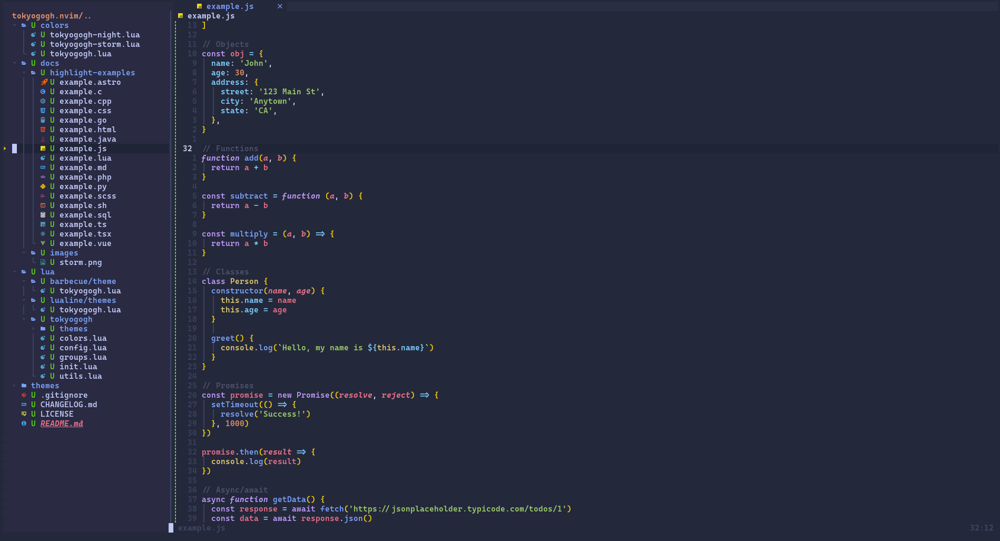
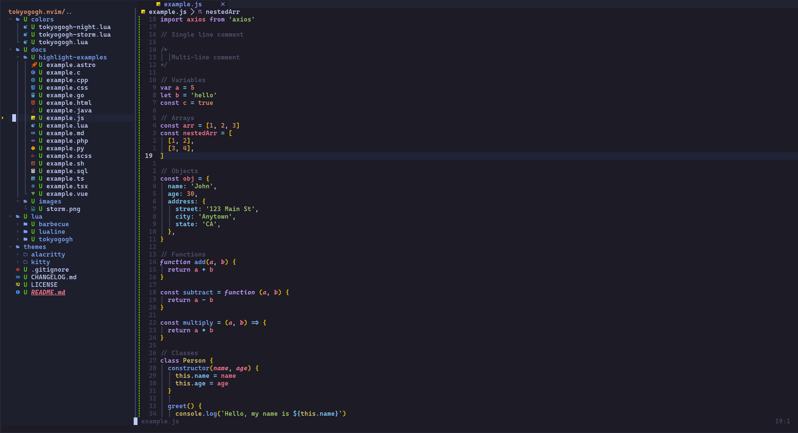

# 🖌️ Tokyo Gogh

A dark Neovim theme written in Lua based on Tokyo Night palettes by Gogh.

Inspired by the Visual Studio Code theme [Tokyo Dark Theme](https://marketplace.visualstudio.com/items?itemName=Avetis.tokyo-night) and [tokyonight.nvim](https://github.com/folke/tokyonight.nvim).

### Features

- Customizable
- **Lualine** theme
- Suport the latest Neovim 5.0 features like LSP and Treesitter
- Supporting multiple plugin
- Vim terminal colors
- Italic support

## Themes

### Tokyo Gogh Storm



### Tokyo Gogh Night



## Requirements

- Neovim >= 0.8

## Installation

Install the theme with yout preferred package manager:

```vim
" Using Vim-Plug
Plug 'cesaralvarod/tokyogogh.nvim', {'branch': 'main'}
```

```lua
-- Using packer
use 'cesaralvarod/tokyogogh.nvim'
```

```lua
-- Using lazy
{ 'cesaralvarod/tokyogogh.nvim', lazy=false, priority=1000 }
```

## Configuration

#### Enable theme

```lua
-- lua
vim.cmd([[colorscheme tokyogogh]])
```

```vim
colorscheme tokyogogh
```

### Change default style

```lua
require('tokyogogh').setup {
  style = 'night' -- storm | night
}

vim.cmd([[colorscheme tokyogogh]])
```

> Options: storm, night, day

## Default configuration

```lua
require('tokyogogh').setup {
  style = 'storm', -- storm | night
  term_colors = true,

	-- Change code styles
	code_styles = {
		strings = { italic = false, bold = false },
		comments = { italic = true, bold = false },
		functions = { italic = false, bold = false },
		variables = { italic = false, bold = false },
	},

	diagnostics = {
		undercurl = true, -- use undercurl instead of underline
		background = true,
	},

  -- Customization
  colors = {},
  highlight = {},
}
```

## Customization

Soon

## Plugins Supported

- [Treesitter](https://github.com/nvim-treesitter/nvim-treesitter)
- [LSPDiagnostics](https://neovim.io/doc/user/lsp.html)
- [NvimTree](https://github.com/kyazdani42/nvim-tree.lua)
- [nvim-ts-rainbow](https://github.com/p00f/nvim-ts-rainbow)
- [nvim-ts-rainbow2](https://github.com/HiPhish/nvim-ts-rainbow2)
- [Telescope](https://github.com/nvim-telescope/telescope.nvim)
- [GitSigns](https://github.com/lewis6991/gitsigns.nvim)
- [Lualine](https://github.com/hoob3rt/lualine.nvim)
  <!-- - [WhichKey](https://github.com/folke/which-key.nvim) -->
  <!-- - [Dashboard](https://github.com/glepnir/dashboard-nvim) -->
  <!-- - [GitGutter](https://github.com/airblade/vim-gitgutter) -->
  <!-- - [VimFugitive](https://github.com/tpope/vim-fugitive) -->
- [NeoTree](https://github.com/nvim-neo-tree/neo-tree.nvim)
- [Bufferline](https://github.com/akinsho/bufferline.nvim)
  <!-- - [DiffView](https://github.com/sindrets/diffview.nvim) -->
- [vim-sneak](https://github.com/justinmk/vim-sneak)
- [Hop](https://github.com/phaazon/hop.nvim)
- [Leap](https://github.com/ggandor/leap.nvim)
- [Lightspeed](https://github.com/ggandor/lightspeed.nvim)
- [CMP](https://github.com/hrsh7th/nvim-cmp)
- [Ident Blankline](https://github.com/lukas-reineke/indent-blankline.nvim)
- [Scrollbar](https://github.com/petertriho/nvim-scrollbar)
- [Lazy](https://github.com/folke/lazy.nvim)
  <!-- - [Mini](https://github.com/echasnovski/mini.nvim) -->
- [Navic](https://github.com/SmiteshP/nvim-navic)
  <!-- - [Barbecue](https://github.com/utilyre/barbecue.nvim) -->
- [Notify](https://github.com/rcarriga/nvim-notify)
  <!-- - [Neotest](https://github.com/nvim-neotest/neotest) -->

## Inspiration

- [tokyonight.nvim](https://github.com/folke/tokyonight.nvim)
- [tokyodark.nvim](https://github.com/tiagovla/tokyodark.nvim)
- [tokyo-night for VSCode](https://marketplace.visualstudio.com/items?itemName=Avetis.tokyo-night)
- [Gogh](https://gogh-co.github.io/)

## License

[MIT](./LICENSE)
